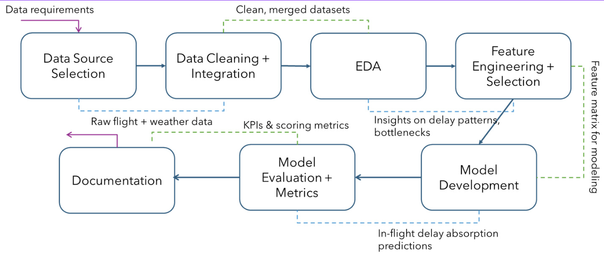
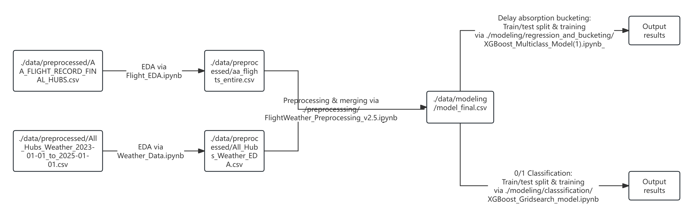

# AA-delay-absorption-modeler-master
This is the main repository for the 2025 CMU-AA Capstone Project: Flight Delay Absorption Modeling and Analysis. It contains all main data tables, code scripts and reports used or generated during the project.

## Project Content and Analytics Pipeline
This project aims to use open-source, flight-record-related data to construct Machine Learning (ML) models that perform: 
- Classification of whether or not a flight is able to recover departure delay while airborne
- Numerical prediction of the amount of departure delay time that a flight could cover while airborne

Our workflow for this project is demonstrated in the figure below.



The main pipeline from raw data sources to model evaluation outputs is shown in the figure below. Directories in some code files may not be completely accurate; check thoroughly before execution.




## Prerequisites and dependencies
To run the main pipeline above, you need Python >=3.9.6 (3.12 and above preferred) and Jupyter (2025.9.1 or later). Download the preprocessed data files using the below links:
- [AA_FLIGHT_RECORD_FINAL_HUBS.csv](https://drive.google.com/file/d/1KGSkBiJovnoivyXJCgga6z2BU4i6z5g8/view?usp=sharing)
- [All_Hubs_Weather_2023-01-01_to_2025-01-01.csv](https://drive.google.com/file/d/1Z3aVc8Fl5FgnsHX6g4x0UHewvSxV0OiT/view?usp=sharing)
And put them into the ```./data/preprocessed``` directory. Or if you plan to skip EDA and merging to download the ready-made dataset for modeling:
- [model_final.csv](https://drive.google.com/file/d/1FihltSRtYGIvCIPg82tP1vNLJr0CvBJ5/view?usp=sharing)

Additionally,,

- An FR24 API access token. This is obtained via subscription to the API service (note: not the flight tracker map subscription!).
- Python>=3.9.6
- Manually download the Reporting Carrier On-Time Performance (https://transtats.bts.gov/Fields.asp?gnoyr_VQ=FGJ) and T-100 Domestic Segments (https://www.transtats.bts.gov/Fields.asp?gnoyr_VQ=FIM) data tables, and put these into the ./inputs subfolder, if running the dot_flight_data_query or dot_flight_data_merge scripts.

Create a virtual environment for code execution:

```powershell
python3 -m venv .<venv_name>
```

Before each run, activate the virtual environment in PowerShell:

```powershell
source .<venv_name>/bin/activate
```

Within the virtual environment, use pip to download the following dependencies:
```powershell
pip install numpy pandas requests fr24sdk
```

After running, deactivate the virtual environment:

```powershell
deactivate
```
